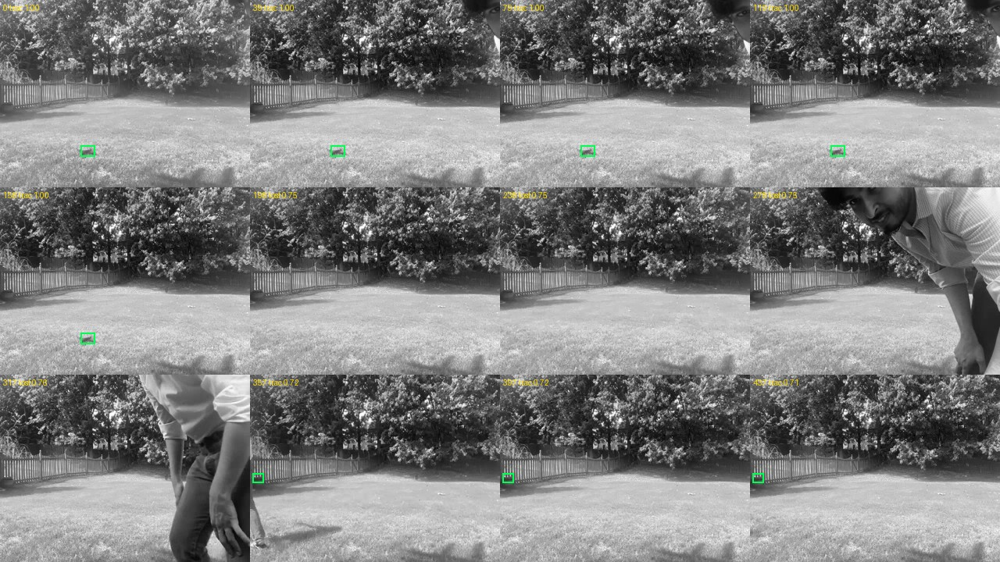

# flyByWire

**In plain terms:** a Mac desk app that puts a cheap Wi-Fi toy drone’s camera next to a live map of a real fruit fly brain (MaleCNS). As the picture moves, parts of that network light up. Takeoff/land/E-STOP are supervised stick packets. An optional **brain yaw assist** trial can bias yaw from the motion readout with a hard clamp — the UDP process still never loads the connectome.


*Workspace: onboard video, activity map, supervised flight controls. E-STOP always available.*

## Quick start

```sh
./start-lab.sh
```

Open http://localhost:3000/ · worker http://127.0.0.1:8766 · logs `.lab-logs/`.

With no live drone link, the workspace replays `data/demo-default.mp4` (strong onboard clip from trial `20260911T004359…`).

### First-time setup

```sh
python3 -m venv .venv
.venv/bin/python -m pip install -r requirements.txt
(cd ui && npm ci)
.venv/bin/python -m lab.download
.venv/bin/python -m lab.prepare
.venv/bin/python -m lab.prepare_full
.venv/bin/python -m lab.full_vision
```

Needs Python 3.14+, Node ≥22.13, FFmpeg, Metal/WebGPU. MaleCNS download ≈ 1.1 GB.

### Checks

```sh
.venv/bin/python -m unittest lab.test_core lab.test_full_engine lab.test_brain_assist -v
(cd ui && npx tsc --noEmit && npm run lint:lab && npm run build)
```

## Layout

```
flyByWire/
  start-lab.sh
  lab/                 # FastAPI worker, engines, flight runner, training
  ui/                  # vinext / React
  scripts/             # probes, retrack_external.py, process_trial_stills.py
  docs/
    screenshots/
    reviews/           # flight, external tracking, drift notes
    benchmarks/
    research/
    BRAIN_AND_TRAINING.md
  data/                # MaleCNS (local) + demo-default.mp4
```

**On disk, not in git:** `recordings/`, `experiments/`, `diagnostics/`, `.venv/`, `ui/node_modules/`.  
**Active readout weights** (local): `experiments/active-quadratic-T4_T5.npz` — refreshed by `.venv/bin/python -m lab.train_from_recordings`.

## How control is split

```
Camera (live RTSP or demo replay) ──► retina ──► frozen MaleCNS (Metal)
                                         │
                                         ├── UI brain view
                                         └── motion score ──shared mem──► optional yaw bias
                                                                         (±6 clamp, assist trial only)

Supervised flight process ──UDP :7099──► drone
  leases · scripted trials · land · E-STOP
```

- Workspace never opens a motor socket (`lab/workspace.py`).
- Flight is a separate process (`lab/flight_runner.py`).
- `brain-yaw-assist-v2`: after settle, yaw offset from motion score via `lab/brain_assist.py`. Human land/E-STOP still win.

## Supervised flight (v2)

1. Floor only — leave drift room (see below).
2. Stationary 10 s (motors off).
3. **Two `clean_stable` baselines** unlock axis pulses / brain assist.
4. Pulse only after stable-hover confirmation; otherwise auto-land.
5. Log outcome; confirm motors stopped.

Details: `docs/reviews/flight-review-20260911.md`.

### Baseline drift (2026-09-11 evening)

Seven new baselines showed **significant lateral drift** under hover. Operator marked drift / incident / no_lift; offline retrack measured end displacements up to ~100 px at 320-wide (e.g. trials `191648`, `191754`). Live external lock often dies at liftoff — use offline retrack for analysis.



Full writeup: [`docs/reviews/DRIFT_20260911.md`](docs/reviews/DRIFT_20260911.md). **Do not unlock steering until two clean baselines exist.**

## Brain & training

See [BRAIN_AND_TRAINING.md](docs/BRAIN_AND_TRAINING.md).

- MaleCNS ~166.7k neurons / ~25.6M connections — frozen reservoir.
- Quadratic T4/T5 readout trained on synthetic clips + flight windows (~70% recording held-out on the active mixed model).
- Retrain: `.venv/bin/python -m lab.train_from_recordings`
- Offline retrack: `.venv/bin/python scripts/retrack_external.py`

## Screenshots

### Workspace / diagnostics / research


### Earlier flight & external sheets


## Drone protocol (this hardware)

- Wi-Fi AP ≈ `192.168.1.1` · RTSP `rtsp://192.168.1.1:7070/webcam` · commands UDP **7099**.
- TC 9-byte packets (axes center 128): takeoff `01`, land `02`, emergency `04`.
- Verified SSID `WIFI-UFO-e48414`. **Physical E-stop still unproven.**

Probes: `python3 scripts/probe_drone.py` (also `probe_cameras.py`, `probe_telemetry.py`).

## Safety

- Always supervise. Floor launches after the table fall.
- Expect hover drift — clear lateral space.
- E-STOP is best-effort software until proven on hardware.
- Closing the UI should land via lease expiry — still watch the motors.

## Attribution

- [MaleCNS](https://male-cns.janelia.org/download/) CC BY 4.0
- [Neural Canvas](https://huggingface.co/spaces/Xenova/fruit-fly-simulation) MIT (spiking shader lineage)
